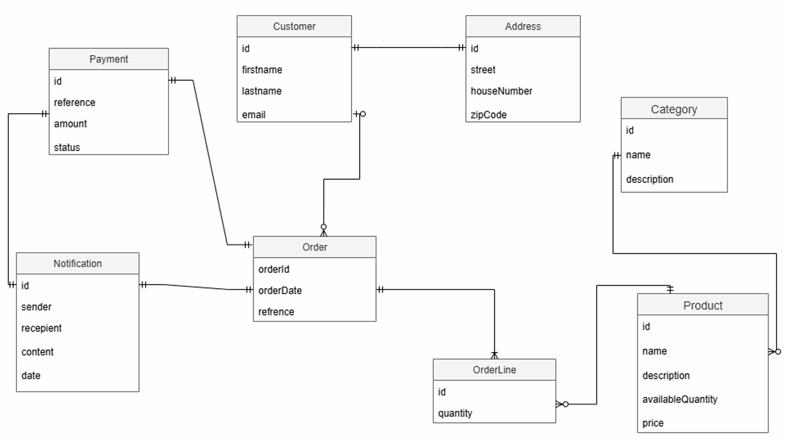
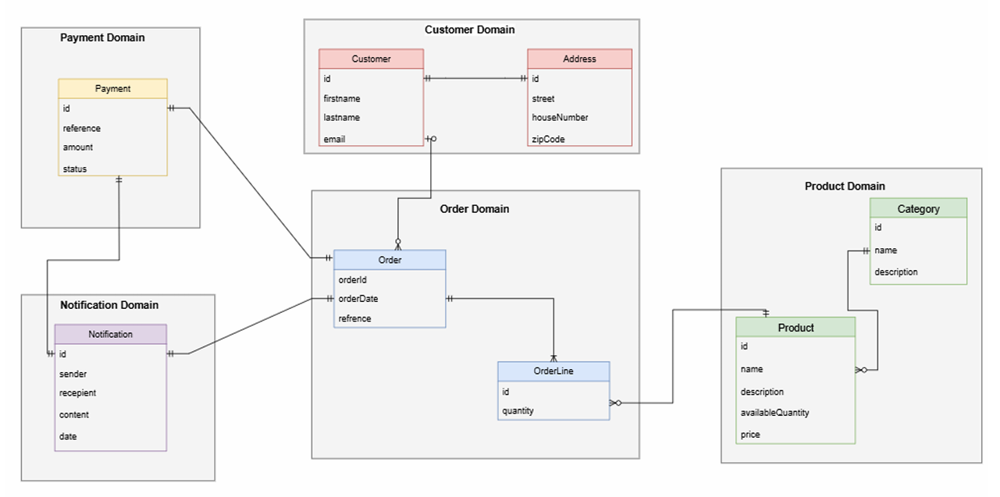

# 🛒 E-commerce Microservices Project

This project is a practical implementation of **Microservices Architecture** using Spring Boot and Spring Cloud.  
The main goal is to build a **distributed, scalable, and secure system** where each service runs independently and communicates with others.

---

## `Micro-Service Design`

 <br>

## `UML System Design`

 <br>

## `Doman Driven Design(DDD)`

 <br>


## 🧩 Project Structure

The system is divided into several independent services:

- 🧑 **Customer Service** → Manages customers.  
- 📦 **Order Service** → Manages orders.  
- 🛒 **Product Service** → Manages products.  
- 💳 **Payment Service** → Handles payment operations.  
- 🔔 **Notification Service** → Sends notifications and emails to customers.  

✨ Each service has its own **database** and can run independently.

---

## 🛠️ Technologies Used

- ⚡ **Spring Boot** → Core framework to build each service quickly
  (spring web -spring Data Jpa -Lombok -Validation). 
- 🔍 **Spring Cloud Netflix Eureka** → Service Discovery (so services can find and register with each other).  
- 🚪 **Spring Cloud Gateway** → A single entry point to the system (API Gateway).  
- 🤝 **Feign Client** → Simplifies inter-service communication without boilerplate RestTemplate code.  
- 📡 **Apache Kafka** → Event-driven communication between services.  
- 🗄️ **PostgreSQL** → Separate database for each service (Database per service).  
- 🐳 **Docker & Docker Compose** → To containerize and run the whole system easily.  
- 🔐 **Keycloak** → Authentication & Authorization to secure the services.  
- 📧 **Java Mail Sender** → To send real emails from Notification Service.  
- 🕵️ **Zipkin + Spring Actuator** → Distributed Tracing to monitor and track the journey of each request.  

---

## 🎯 Benefits

- 🔄 Each service can be scaled or developed independently.  
- 🛡️ System resilience → if one service goes down, others remain functional.  
- 🔗 Easier inter-service communication (thanks to Feign & Kafka).  
- 🔐 Strong security from the start using Keycloak.  
- 📩 Automatic notifications and emails to customers (e.g., after successful payment).  
- 🕵️ Full observability with Zipkin to trace requests end-to-end.  
- ⚙️ Flexibility to add new services or update existing ones without affecting the rest.  

---

## 🚀 How to Run

1. Clone the repository:  
   ```bash
   git clone https://github.com/habibaraab/E-commerce-microservice.git
   ```
2. Navigate to the project directory.  
   ```bash
    cd E-commerce-microservice
      ```
3. Start services using Docker Compose:  
   ```bash
   docker-compose up -d
   ```
4. Access the system through the **API Gateway** at:  
   ```
   http://localhost:8222
   ```

---

## 📌 Notes

- Make sure Docker and Docker Compose are installed.  
- Keycloak needs to be configured with the proper realms, clients, and roles for authentication.  
- Zipkin can be accessed at:  
  ```
  http://localhost:9411
  ```

---